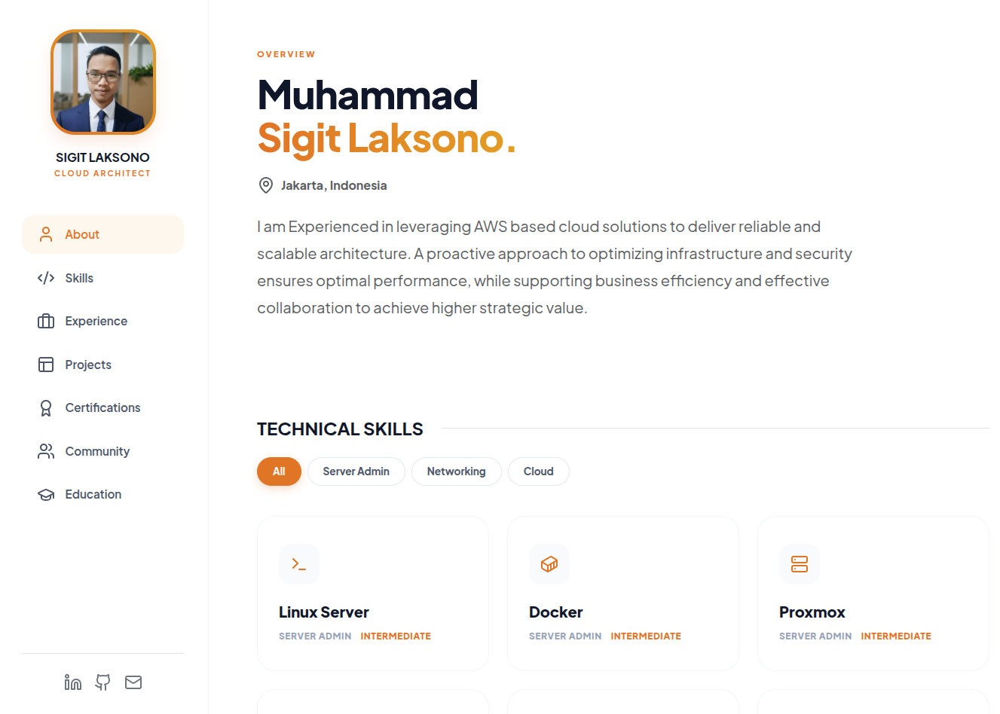

# Personal Portfolio

Personal Portfolio - Fully static website built with HTML, CSS, and JavaScript. Ready to deploy on GitHub Pages or any static hosting.



[🌐 Live Preview](https://sigitlaksono.my.id)

## 🚀 Quick Start

```bash
# Clone repository
git clone <repository-url>

# Buka langsung di browser
open index.html
```

## 📁 Struktur

```
portfolio/
├── index.html              # HTML
├── css/
│   └── custom-styles.css   # Styling CSS
├── js/
│   └── main.js            # JavaScript
└── img/                   # Images
```

## 🛠️ Teknologi

- HTML5, CSS3, Vanilla JavaScript
- Bootstrap 5 (CDN)
- Lucide Icons (CDN)

## ✨ Fitur

- Responsive design (mobile, tablet, desktop)
- Smooth scrolling navigation
- Filter untuk Skills & Projects
- Mobile sidebar menu
- Fast loading

## 📝 Customization

### Change Colors
Edit colors in `css/custom-styles.css`:
```css
:root {
    --primary-orange: #f97316;
    --primary-amber: #f59e0b;
}
```

### Change Content
Edit content in `index.html`

## 🚢 Deploy

Deploy to GitHub Pages or any static hosting platform.
